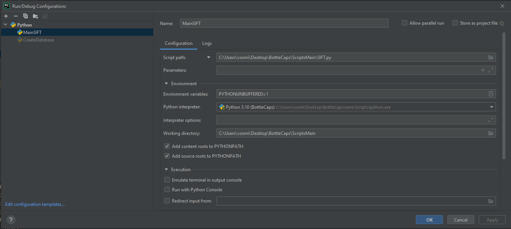

# BottleCaps

The idea behind this app is to maintain a database of all the bottle caps you have collected, and then take a photo of some caps that you have found or someone else has. The app will then compare the photo with the caps in the database and tell you whether or not you already have that cap. 

## Summary

BottleCaps is an application that uses computer vision _(mainly OpenCV)_ and other algorithms to detect and match bottle caps from a database. Currently, it only works locally, but the plan is to make it work with AWS servers using a lambda function. It employs the following OpenCV methods: __Simple Blob Detector__, __Hough Transform Circles__, and __Scale-Invariant Feature Transform__. Preprocessing is required for each step of the image.

## Code Flow

The following is an explanation of how the code works. The actual code will not be described in detail.

### Creation of the database

The database is created using json, each file of the database has descriptors, keypoints and name among other iformation. The numebr of keypoints and descriptors is limited to a variable.

### Blobs detection

Initially, I attempted to use Hough Transform Circles directly, but it resulted in multiple false positives because the program could not determine the size of the circles. As multiple caps could be present in a photo, the radius of the circles could differ. To overcome this, I applied Simple Blob Detector first. Before this, I reduced the color of the photo to 3 levels (it is suggested to take the photo on a white background or against caps with high contrast from the background). Overlapping blobs were removed as they were not needed and could be multiple detections of the same cap. The median size of all blobs was then determined.

- Why median over average? Sometimes a large blob might be a false positive and not relevant. If the average was used, this would increase the radius and produce incorrect results. The same issue would occur for small false positives. All bottle caps have a diameter of 37mm.

### Hough Transform Circles

Using the approximate radius determined from the blobs, a lower and upper bound was established. Preprocessing was then applied before Hough Transform Circles was used to determine the positions of all circles.

### Scale-Invariant Feature Transform

With the positions of the circles and their radii determined, the image was cropped and each crop was compared to an entry in the database using a comparison method. The best match was kept if it was a match or not.

## How to Install and test
Note: As currently this project is not finished I am not releasing an app yet, as I have to finish the algorithm and the Flutter app. Here are the steps on how to download the project and test the algorithm.

1. Download this project and uncompress it. 
2. You must have installed Python3 (I am using Python 3.10 it can work with other versions, but I recommend this one). You can install it from [here](https://www.python.org/downloads/).
3. Download Pycharm, you can download it from [here](https://www.jetbrains.com/es-es/pycharm/download/#section=windows) _(Note: It could work without Pycharm and instead use the terminal, but I recommend using this configuration.)_
4. Have this set up for the running configuration:

5. Run `<REPOSITORY_PATH>/ScriptsMain/SIFT.py`

The bottle caps database is in `<REPOSITORY_PATH>/database/caps-resized/`. If you want to add more images there you have to run `<REPOSITORY_PATH>/ScriptsMain/CreateDatabase.py`. Then it will create the `.json` files in `<REPOSITORY_PATH>/database/cluster`. There is the real database.

## Example 

Example of the SIFT script. Here you can see it has a lot of improvements points. All 4 caps should be detected as green as they are in the database. The first two work correctly but the two on the bottom are labeled incorrectly. Also speed should be improved. On the `ScriptsMain/note_tests/README.md` you can see some more notes about the tests.

## Tasks - TO DO 

The following tasks are currently under development or planned for the future:

- Implement a tree structure for the database or use clustering to group images, reducing the algorithm from $O(n^2)$ to $O(nlogn)$ using trees or $O(nk)$ using clustering (where $k$ is the number of clusters).
- Improve the match decision by using the maximum number of keypoints detected in an image. This will determine the threshold. If an image has low quality, fewer keypoints will be detected, and it would not make sense to maintain the threshold for a high-quality image.
- Develop an Android and iOS app using Flutter (currently under development).
- Deploy on AWS using a lambda function.
